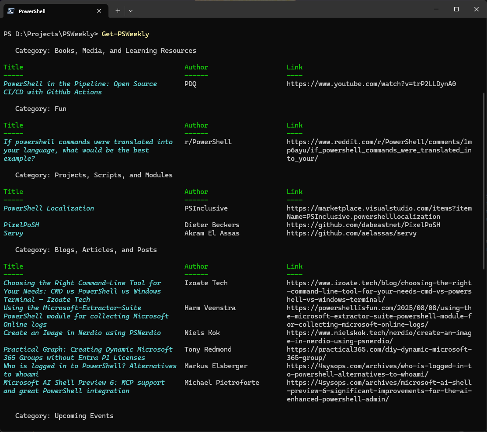

# PSWeekly
A module to deliver PowerShell Weekly directly to your terminal

# Installation

```powershell
Install-Module PSWeekly
```

# Commands

| Cmdlet | Synopsis |
| ------ | -------- |
| [Find-PSWeekly](docs/Find-PSWeekly.md) | Get a list of PSWeekly posts based on month and year. |
| [Get-PSWeekly](docs/Get-PSWeekly.md) | Returns the latest PSWeekly post and its associated links. |
| [Get-PSWeeklyCreator](docs/Get-PSWeeklyCreator.md) | {{ Fill in the Synopsis }} |
| [Search-PSWeeklyLink](docs/Search-PSWeeklyLink.md) | Searches for PSWeekly links based on specified criteria. |

